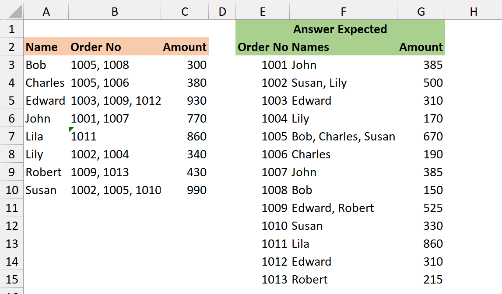
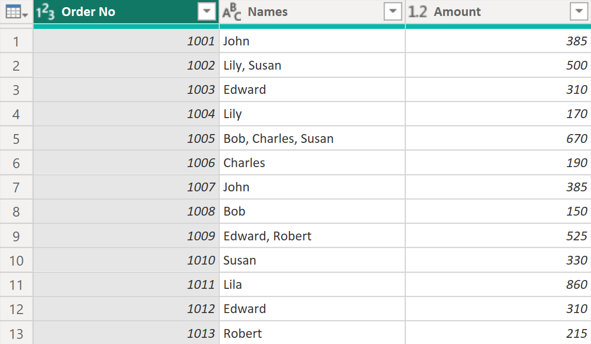

## Table of Contents
- [Table of Contents](#table-of-contents)
- [Problem Statement | Source](#problem-statement--source)
- [Setup: Table Schema and Sample Data](#setup-table-schema-and-sample-data)
- [Table Preview](#table-preview)
- [Expected Output](#expected-output)
- [Solution](#solution)

## Problem Statement | [Source](https://www.linkedin.com/in/excelbi/ "Excel BI")

In the problem table, if there are more than one order number, then amount will be equally divided among order numbers. Hence for row 3, 1005 has amount of 150 and 1008 has amount of 150.
Align the data on the basis of sorted order numbers and sum the amount at order number level.



## Setup: Table Schema and Sample Data
```
let
    Source = 
        Table.FromRows (
            Json.Document (
                Binary.Decompress (
                    Binary.FromText (
                        "TY5BC8IwDIX/iuTcQ7LWtb0qu4gnPZYdOjaYMFboFPHfmzYiuyS8fO/xEgKc0gAKCPGoDjwdC40IvQpwnmNepm2P24Kd4G58xzwK1ZX6Mqnhk9fiuaR5FQdVh2VhrbDrY4mVEfFy7f/6kURTE6Y0GmG3NEz5KVS6NAvz67q/trjuo/VlwvKOZ0v/BQ==", 
                        BinaryEncoding.Base64
                    ), 
                    Compression.Deflate
                )
            ), 
            let
                _t = ((type nullable text) meta [Serialized.Text = true]) 
            in
                type table [ Name = _t, #"Order No" = _t, Amount = _t ]
        ), 
    ChangedType = 
        Table.TransformColumnTypes (
            Source, 
            { { "Name", type text }, { "Order No", type text }, { "Amount", Int64.Type } }
        )
in
    ChangedType
```

## Table Preview
| Name    | Order No         | Amount |
|---------|------------------|--------|
| Bob     | 1005, 1008       | 300    |
| Charles | 1005, 1006       | 380    |
| Edward  | 1003, 1009, 1012 | 930    |
| John    | 1001, 1007       | 770    |
| Lila    | 1011             | 860    |
| Lily    | 1002, 1004       | 340    |
| Robert  | 1009, 1013       | 430    |
| Susan   | 1002, 1005, 1010 | 990    |

## Expected Output
| Order No 	|        Names        	| Amount 	|
|:--------:	|:-------------------:	|:------:	|
| 1001     	| John                	| 385    	|
| 1002     	| Lily, Susan         	| 500    	|
| 1003     	| Edward              	| 310    	|
| 1004     	| Lily                	| 170    	|
| 1005     	| Bob, Charles, Susan 	| 670    	|
| 1006     	| Charles             	| 190    	|
| 1007     	| John                	| 385    	|
| 1008     	| Bob                 	| 150    	|
| 1009     	| Edward, Robert      	| 525    	|
| 1010     	| Susan               	| 330    	|
| 1011     	| Lila                	| 860    	|
| 1012     	| Edward              	| 310    	|
| 1013     	| Robert              	| 215    	|

## Solution
1. **Solution 1**:
    ```
    let
        Source = Table,
        Split = Table.TransformColumns (
            Table,
            List.Transform (
                Table.ColumnNames ( Source ),
                ( c ) => { c, each try Text.Split ( _, ", " ) otherwise { _ } }
            )
        ),
        Transform = Table.CombineColumns (
            Split,
            Table.ColumnNames ( Split ),
            each
                let
                    a = Table.FillDown (
                        Table.FromColumns (
                            _,
                            type table [ Name = text, Order No = Int64.Type, Amount = number ]
                        ),
                        { "Name", "Amount" }
                    ),
                    b = Table.TransformColumns (
                        a,
                        {
                            { "Amount", each _ / Table.RowCount ( a ), type number },
                            { "Order No", each Number.FromText ( _ ), Int64.Type }
                        }
                    )
                in
                    b,
            "x"
        )[x],
        Combine = Table.Combine ( Transform ),
        Group = Table.Group (
            Combine,
            { "Order No" },
            {
                { "Names", each Text.Combine ( [Name], ", " ), type text },
                { "Amount", each List.Sum ( [Amount] ), type number }
            }
        ),
        Sort = Table.Sort ( Group, { "Order No", Order.Ascending } )
    in
        Sort
    ```
2. **Solution 2**
    ```
    let
        Source = Table,
        Rows = Table.ToRows ( Source ),
        Transform = List.TransformMany (
            Rows,
            ( x ) =>
                let
                    a = List.Transform ( Text.Split ( x{1}, ", " ), Number.From ),
                    b = List.InsertRange (
                        List.RemoveRange (
                            List.Transform ( x, ( i ) => List.Repeat ( { i }, List.Count ( a ) ) ),
                            1,
                            1
                        ),
                        1,
                        { a }
                    ),
                    c = Table.FromColumns (
                        b,
                        type table [ Name = text, Order No = Int64.Type, Amount = number ]
                    ),
                    d = Table.TransformColumns (
                        c,
                        { "Amount", each _ / List.Count ( a ), type number }
                    )
                in
                    { d },
            ( x, y ) => y
        ),
        Combine = Table.Combine ( Transform ),
        Group = Table.Group (
            Combine,
            "Order No",
            {
                { "Names", each Text.Combine ( [Name], ", " ), type text },
                { "Amount", each List.Sum ( [Amount] ), type number }
            }
        ),
        Sort = Table.Sort ( Group, "Order No" )
    in
        Sort
    ```
3. **Solution 3**
    ```
    let
        Source = Table,
        a = Table.TransformRows (
            Source,
            each
                let
                    a = [
                        Name    = [Name],
                        OrderNo = List.Transform ( Text.Split ( [Order No], ", " ), Number.From ),
                        Amount  = [Amount] / List.Count ( OrderNo )
                    ],
                    b = Record.ToList ( a ),
                    c = List.Transform ( b, ( x ) => if x is list then x else { x } ),
                    d = Table.FillDown (
                        Table.FromColumns (
                            c,
                            type table [ Name = text, Order No = Int64.Type, Amount = number ]
                        ),
                        { "Name", "Amount" }
                    )
                in
                    d
        ),
        b = Table.Combine ( a ),
        c = Table.Group (
            b,
            { "Order No" },
            {
                { "Name", each Text.Combine ( [Name], ", " ), type text },
                { "Amount", each List.Sum ( [Amount] ), type number }
            }
        ),
        d = Table.Sort ( c, { "Order No", Order.Ascending } )
    in
        d
    ```
    